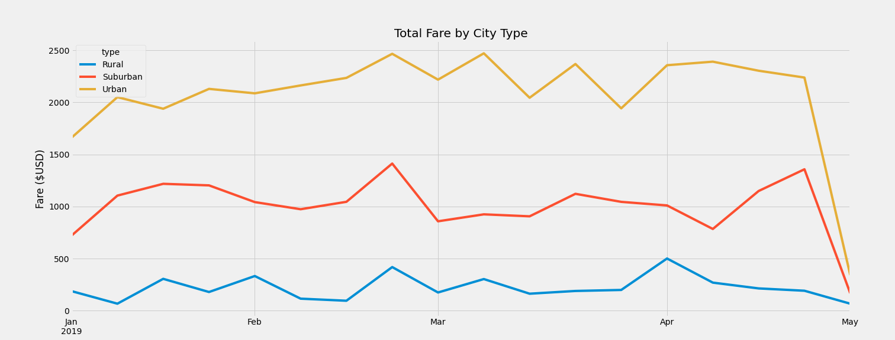
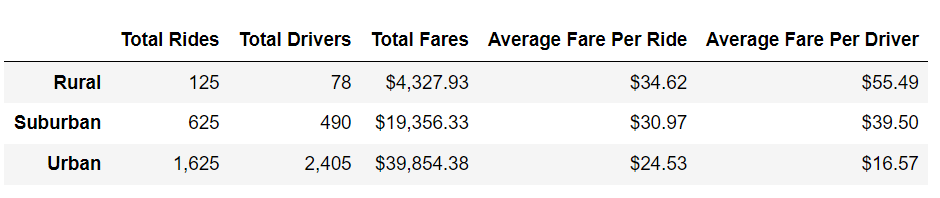

# PyBer_Analysis

# Overview
As a new employee at PyBer we are given a new project to help better understand how the ride-sharing data can be used in the future. In this project we are using data from 2019 to help create new summary dataframes and come up with a chart to help understand what changes need to be made in order for the company to be successful. Our work will help V. Isualize and her colleagues get a better understanding of how each city type operated based on the count of drivers and fares. 

# Results

While looking at the PyBer Fare Summary Chart we can see that Urban had the highest amount of earnings out of the three city types. This has to do with the fact that Urban has the most drivers, almost five time the amount of drivers of Suburban city type and nearly thirty times more drivers then Rural. 

However, when we start to compare the the Avergae Fare Per Ride we see that both Rural and Suburban were charging more per ride and per driver compared to the Urban which had the lowest amount for both Ride and Driver. The data in fare summary gives us more of clarification to better understand the Pyber Fare Summary chart and how the Urban is the money making area for the PyBer Ride-Sharing App.

# Summary
It’s very clear that some changes have to be made in order for PyBer to succeed. First, we need to look at how we can standardize the fare amount across all three different city types. With PyBer charging the same amount this will help increase the weekly revenue. Next, we have to look at the amount of drivers in the each city type. Since Urban had the least amount of fares per driver we can decrease the number of drivers by 405 and increase the average fare per ride to $30.04 this will increase our revenue for Urban by $20,225.61. A similar concept could be applied to both Suburban and Rural depending on the total amount of rides.    